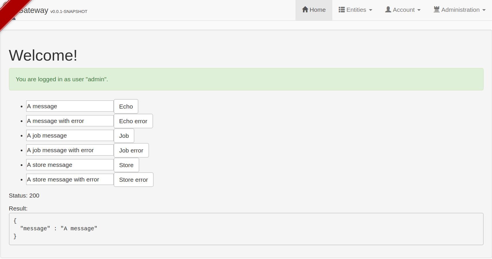
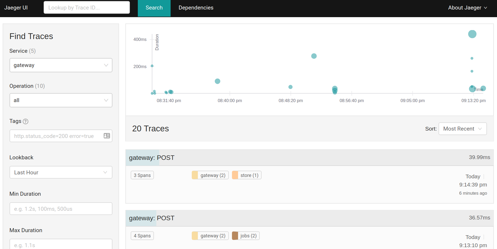
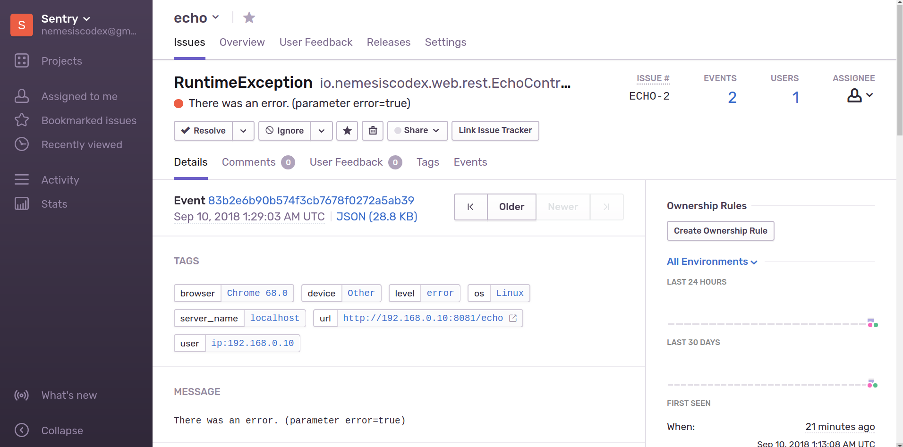

# Microservices monitoring

- Distributed tracing with Jaeger
- Error tracking with Sentry.io

# Usage:

1. Start docker containers:
    ```bash
    $ docker-compose up -d
    $ docker-compose exec sentry sentry upgrade # Setup admin user
    $ docker-compose restart sentry 
    ```
    1. Jaeger url: http://localhost:16686/
    1. Sentry url: http://localhost:9000/sentry/
        1. Add a java projects in sentry
        1. Update application.yml with dsn (check comments on application.yml)
1. Run applications:
    ```bash
    $ cd gateway && ./mvnw
    $ cd echo && ./mvnw
    $ cd store && ./mvnw
    $ cd jobs && ./gradlew
    ```
1. Start testing
    1. Gateway app: http://localhost:8080/
      
      
      
