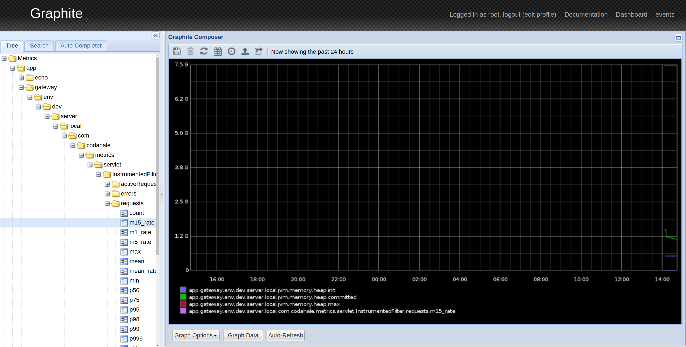
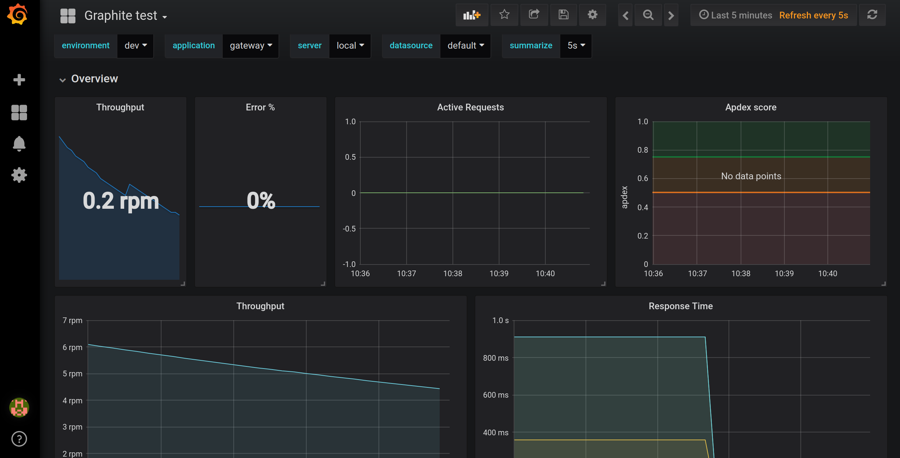

# Microservices monitoring

- Distributed tracing with Jaeger
- Error tracking with Sentry.io
- Monitoring dashboard with graphite and grafana

# Usage:

1. Start docker containers:
    ```bash
    $ docker-compose up -d
    $ docker-compose exec sentry sentry upgrade # Setup admin user
    $ docker-compose restart sentry 
    ```
    1. Jaeger url: http://localhost:16686/
    1. Sentry url: http://localhost:9000/sentry/
        1. Add a java projects in sentry
        1. Update application.yml with dsn (check comments on application.yml)
    1. Graphite url: http://localhost:9091/
    1. Grafana url: http://localhost:3000/
        1. Add graphite as datasource
        1. Create your own dashboards
        1. Metrics of the application are in this prefix: 
        ```
        app.$application.env.$enviroment.server.$server
        ```
        e.g.: `app.gateway.env.dev.server.local`
1. Run applications:
    ```bash
    $ cd gateway && ./mvnw
    $ cd echo && ./mvnw
    $ cd store && ./mvnw
    $ cd jobs && ./gradlew
    ```
1. Start testing
    1. Gateway app: http://localhost:8080/
      
      
      
      
      
